# realm-kotlin-jetpack-compose-sync-example

Sample application on how to implement an Android Application with Kotlin, Jetpack Compose and AppServices/Realm Flexible Sync. 
It also contains a simple backend in a HTML file that can be used to interact with the application.

## Functionality

Implement a basic To Do List, where you can add tasks and mark them as `Done` or `Discarded`. It's actually
pretty simple but showcases a few functionalities from Realm.

### Adding a new task

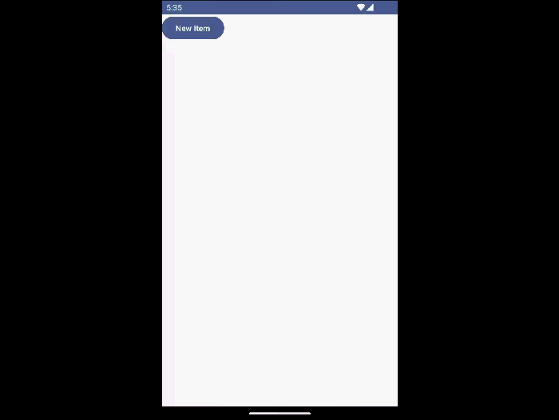

### Changing a task status


### Receiving Notifications from the Back Office


### Receiving a new task from the Back Office

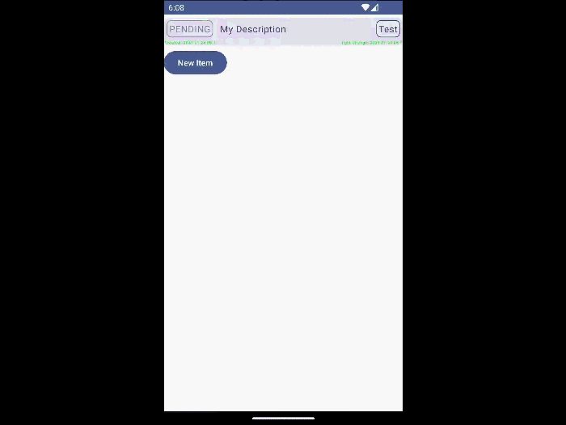

## Requirements to run

* A working Android Studio Setup
* The Realm CLI: https://www.mongodb.com/docs/atlas/app-services/cli/
* A MongoDB Client:
  * Either the MongoShell: https://www.mongodb.com/try/download/shell
  * Or Compass: https://www.mongodb.com/try/download/compass

## How To Configure

1. Create a new **Free** Account in MongoDB Atlas: https://www.mongodb.com/cloud
2. Create a new cluster in AWS, Ireland, named "Test". You can keep everything else as default.
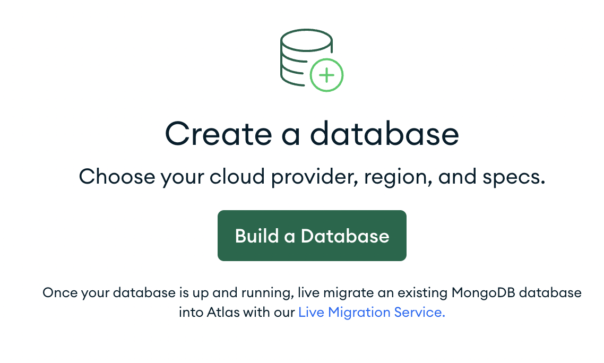

| 1                                                              | 2                                                            |
|----------------------------------------------------------------|--------------------------------------------------------------|
| 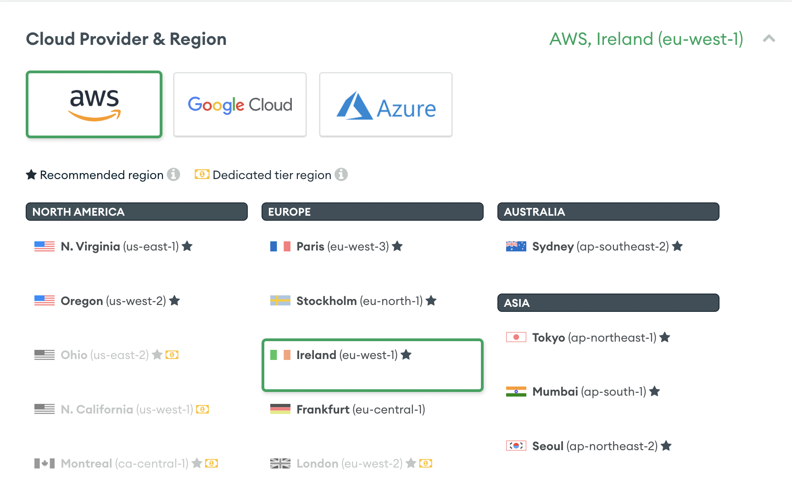 | 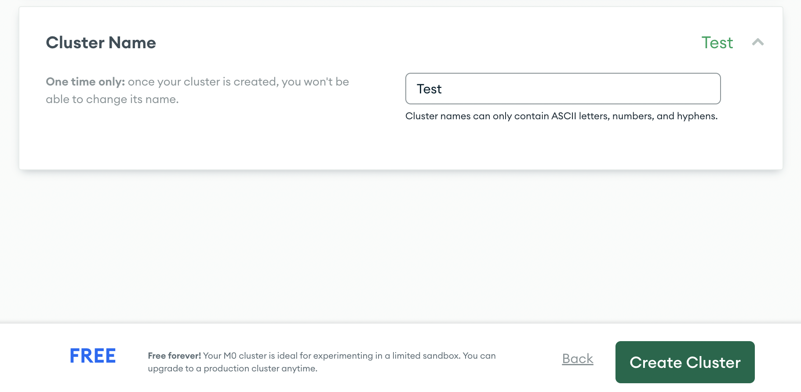 |

3. Also, create a new administrator user. Follow the steps in the screen.
4. 
5. Go to Access Manager, Project Access, and API Keys.
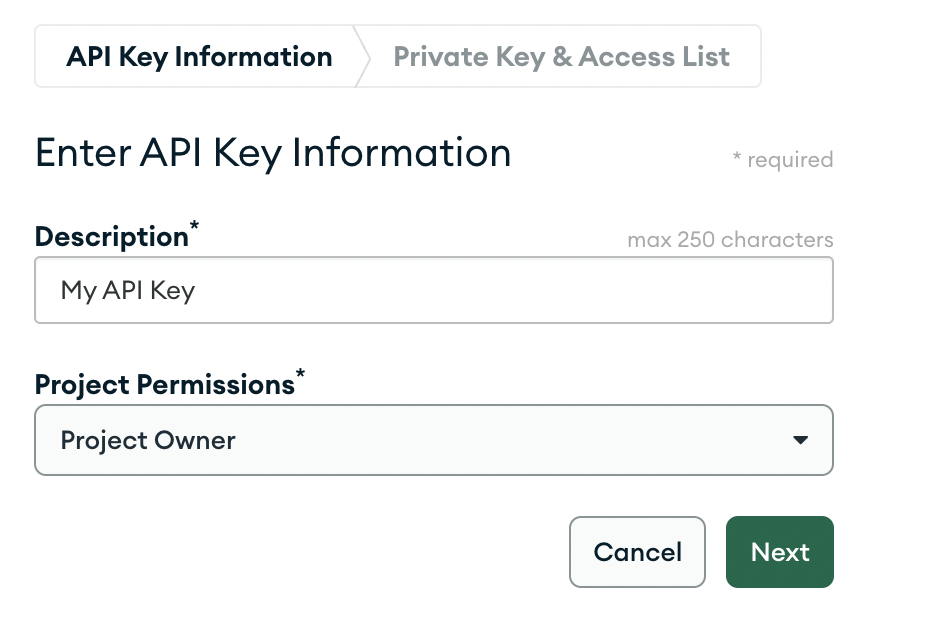

6. Remember to add **your own public IP** to the Access List. Do not use 0.0.0.0. Store the public key and the private key.

7. Login with your Realm cli:
```sh
realm-cli login --api-key "$PUBLIC_API_KEY" --private-api-key "$PRIVATE_API_KEY" --yes
```

6. Deploy the application for the first time:
```sh
realm-cli push -y
```

7. If you are using a paid version of MongoDB Atlas instead of the free tier. You can enable hosting. 
For our example, we won't use hosting.
8. Create the users for the Android application:
```sh
realm-cli users create --type email --email 'example@acme.com' --password '123456'
realm-cli users create --type email --email 'admin@acme.com' --password '123456'
```

9. Get the user ID from the admin user (it will be an hexadecimal string, like `63d018499d6f043532957a89`) and save it. 

10. Connect to MongoDB. Here is an example on how to use Compass and Atlas.

| 1                                      | 2                                      | 3                                      |
|----------------------------------------|----------------------------------------|----------------------------------------|
| 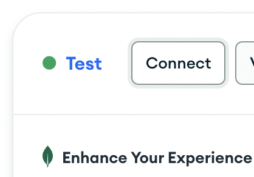 | 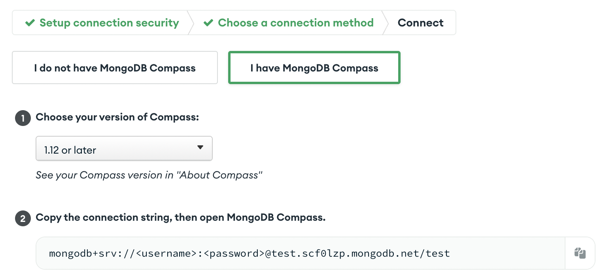 | 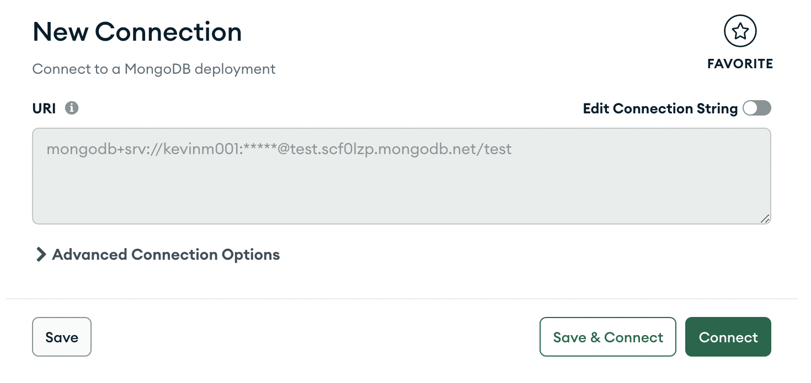 |

11. Open the MongoShell `>_MONGOSH` tab on the bottom of the Compass window, and run the following command:

```js
use androidapp
db.CustomUserData.insertOne({ 
  isGlobalAdmin: true,
  ownerId: "$YOUR_ADMIN_ID_IN_STEP_9"
})
```

12. Open the file `realm_config.json` and copy the `app_id`.
13. Replace in all the project files the string `<your-app-id>` with the app_id value.
14. Start the application using an Android phone or emulator (using Android Studio).

### How to test synchronisation

When you create a new item in the application, it should be created also in Atlas. If you still have
Compass open, you can navigate to the androidapp.TodoListItem collection:

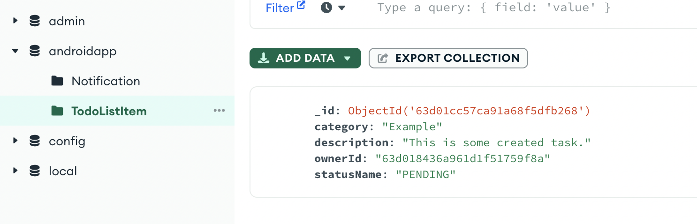

### How to test notifications

Open the backend, it's a simple html file. You can use the open command to open the browser:

```sh
open hosting/files/index.html
```

Login with the example user:

* Username: example@acme.com
* Password: 123456

And send a notification using the Notify button.

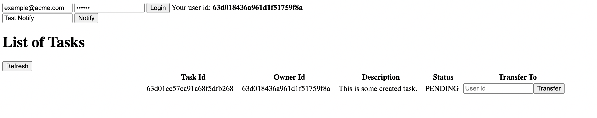

## Note

This application is not supported by MongoDB, it's just a sample application that I've done to showcase a few functionalities
from Realm and Atlas AppServices.